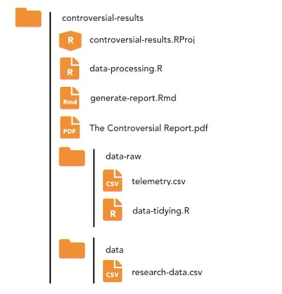

--- 
title: "Tidyverse Learnings"
author: "Author: [Can Aytöre](https://github.com/canaytore/)"
date: "Last Update: `r Sys.Date()`"
favicon: "favicon.jpg"
site: bookdown::bookdown_site
---

# Introduction

## Aim

## Motivation


# Get Started with `tidyverse`

## The R Language

The R language is an extremely popular scripting language used by millions of people around the world. Primarily, it's used for data analysis, modeling, and visualization. Many people think of R as statistical software, but it's fundamentally not and it's a little bit upsetting when people say that. R is programming language that has been adopted and curated by people interested in doing data science as flexibly as possible.

R lives and breathes at the comprehensive R archive network, abbreviated to CRAN. When you download R from CRAN, you've actually installed Base-R. Base-R includes all of the necessary machinery for your computer to be able to run R code. It also installs standard R packages like `stats`, `utils` and `graphics`. These packages allow you to start using R immediately on your machine. In order for data manipulation, using Base R is sufficient most of the time. The Base R way of doing things involves a code that looks very much like this;

```{r echo=TRUE, message=FALSE, warning=FALSE}
head(iris[iris$Species == "virginica",])
```

First to access to 'species' column and then we have a double equals to say 'species' is equivalent to 'virginica' and then we have a comma to say we want all of the columns and then the final closing square bracket. 

## R Packages

It's possible to do every single thing you could possibly imagine with Base-R because it is a true and complete programming language but you would have to write a lot of code yourself. Most people jump straight into using R packages to make their life easier and more reproducible, so what are R packages? R packages are self-contained collections of functions and/or datasets that provide us with the ability to do any number of things from analyzing data, visualizing data to potentially even generating reports with R which is what R Markdown allows us to do. Now, CRAN has over 10,000 packages and this comprehensive range of packages available from CRAN is part of what makes R such a popular scripting language.

It's a fact of programming and scripting but building everything yourself from scratch is time consuming and more than likely, hugely error prone, this is why R users depend on packages. Using packages makes it easier to start working on a new project in R. Packages can make collaborating with others on R projects easier, as you can be ensured everyone is using the same code base. 

# What is Tidyverse?

There are definitely one or two packages that would make your life with R a little bit easier, i.e. they're designed to do the kind of analysis or data visualization which is important to your domain-specific knowledge. The tidyverse is an ecosystem of R packages designed to work consistently and interdependently together to provide a flexible and easy-to-understand workflow for doing data science with the R language. The fundamental building block of the tidyverse is the concept of tidy data. The tidyverse has been in development since early 2014 and is becoming increasingly mature. But the tidyverse should never be considered a replacement for Base R. It will remain crucial to understand the base R way of doing things.

- In other words, the tidyverse is both a collection of R packages, and an approach to how to do data science effectively, and reproducibly with the R language.

## Why use the Tidyverse?

So what makes the tidyverse different? Well, the core of the tidyverse is developed by developers at RStudio. It's a company with an extremely good reputation including, for R package development. RStudio's own internal tools dependent on components of the tidyverse, helping to reassure us of the long term viability of the tidyverse ecosystem. Tidyverse is developed openly on GitHub, meaning users can track continuing development and if necessary, fork packages in the future if Rstudio themselves, stop updating them.

## Strengths of Tidyverse

What does the tidyverse provide us as end users or data scientists? Well, using tidyverse leads to advantages in the following main areas: 
- Data importation
- Data wrangling
- Data visualization

### Data import

Let's look at each of those. `readr` completely blows away the base-R tools for importing rectangular data files like csv (comma-separated values) and tsv (tab-separated values) files. It's not only significantly faster than base-R but it's more intelligent. For instance, automatically converting dates to dates, times to times, and converting columns that should be numbers into numbers. And finally, it never ever imports columns of strings as factors. If you're already a base-R user, chances are you've spent hours of frustration because of this issue using base-R. **This section** includes importing data with `readr` as it's for general workhorse of most R users data import toolkit. The `readxl` library makes importing from excel files ridiculously simple allowing worksheets, individual cells, or even cell ranges to be targeted for import easily. The tidyverse also aims to fit into existing workflows. `haven` allows data to be imported from SAS, SPSS, and Stata. Now these three packages significantly decrease the time needed to massage data files into R. And help solve a number of common frustrations with base-R packages. But please note that `readr` is the only package of the three that is part of the core `tidyverse`. You need to separately load `readxl` and `haven` to access those libraries. 

### Data wrangling

The tidyverse utilizes the pipe operator (%>%). This percentage greater than percentage thing to provide a logical framework for chaining together common data wrangling tasks. This makes code very faster to write and easier to read. There's **a chapter** dedicated to the pipe operator as it is mysterious magic to many R users. The tidyverse is designed around a concept of *tidydata*. The `tidyr` library is designed for reshaping and transforming your imported data into a structure ready to manipulate, model, and visualize with the tidyverse. `dplyr` is the library for sub-setting, filtering, summarizing, and generally wrangling your data. It also provides a number of tools for doing database-like operations for working on relational datasets. These packages used together form a core data processing component of the tidyverse. The operations you'll perform with these are both significantly faster and simpler to construct than simply using base-R. `ggplot2` provides a complete consistent and incredibly powerful grammar of graphics, allowing impressive static visualizations to be built with minimal effort. 

I'm going to quickly show what's possible using all the components for tidyverse together. After loading libraries `gapminder` and `tidyverse`, we have a little bit of code which uses `dplyr` (to group my data by continent and year, and then summaries to calculate the continent population). And then I use `ggplot2` to generate my chart. I have quite a beautiful looking **static** visualization generated with `ggplot2`. It's important to know that `ggplot2` provides a powerful consistent grammar for creating static shots. 

```{r echo=TRUE, message=FALSE, warning=FALSE}
library("gapminder")
library("tidyverse")

gapminder %>%
  group_by(continent, year) %>%
  summarise(continent.population = sum(as.numeric(pop))) %>%
  ggplot(aes(x = year, y = continent.population)) +
  geom_area(aes(fill = continent), position = "stack") +
  ggtitle("Gapminder population growth per continent",
          subtitle = paste("from", min(gapminder$year), "to", max(gapminder$year)))
```

If you're interested in building interactive charts for the web with R, you'll need to learn about `htmlwidgets`. But in most commonly used `htmlwidgets` libraries, lean heavily on the tidyverse for preparing data for visualization. Plus all the good `htmlwidgets` are designed to use the pipe operator. Let's have a look at what we could build using `htmlwidgets` in R. We use the `dplyr` library to wrangler our data. And then we build our chart in the `highcharter` library. So instead of a **static** chart, what we have now is an **interactive** chart that I can move my cursor through and get information for specific points in the dataset. I can also actually remove series if I'm interested in doing that. So, `ggplot2` is part of the `tidyverse` and allows us to build static charts in a consistent manner. `htmlwidgets` allows us to create interactive charts and often depends on the tidyverse for wrangling and constructing our data for visualization. 

```{r echo=TRUE, message=FALSE, warning=FALSE}
library("gapminder")
library("tidyverse")
library("highcharter")

gapminder %>%
  group_by(continent, year) %>%
  summarise(continent.population = sum(as.numeric(pop))) %>%
  hchart("area",
         hcaes(x = year, 
               y = continent.population, 
               group = continent)
         ) %>%
  hc_plotOptions(area = list(stacking = "normal")) %>%
  hc_tooltip(shared = TRUE)
```

And finally, there's the `shiny` library which allows us to build web applications using only the R language without knowing any html or javascript. And `shiny` allows us to use `htmlwidgets` to embed interactive charts inside of our web applications.

## Maintain the Tidyverse

So how do we go about maintaining the tidyverse? Well, remember that in order to use the tidyverse on our system we've installed three discrete things: R itself, RStudio, and the tidyverse collection of packages. To keep fully up to date with the tidyverse, unfortunately we really need to keep on top of all three of these things individually. So let's look at how we do that. 

The process you need to go through to keep up to date with R is the most frustrating of all the three tools since there's not a consistent way to do this from within RStudio. Base-R is updated approximately 4 times a year but there's not a regular release cycle. I'd advise that you check every few months for a new version of R. If R console tells you there's a newer version then type a <kbd>y</kbd> + <kbd>Enter</kbd> and this will launch you to your web browser to the downloads page for R for your operating system. When you're there it's really important to check the release date of that version of R. I thoroughly advise that you do not update R until the release is at least one month old. This is to give the package maintainers that you rely on enough time to update their packages to depend on this new version of R. 

So how about updating RStudio? Well, RStudio will automatically check whether there's a new version of RStudio available when you open it up. Updates are typically released a few times a year and generally they include awesome new features that are of general interest. For instance support for new features in R markdown documents or simply making it easier to publish Shiny apps. I thoroughly recommend that as soon as RStudio tells you there's a new version click update, it will take you to the RStudio website and allow you to download the new version. 

So how about keeping the tidyverse up to date? Well thankfully that's quite simple. The constituent components of the tidyverse don't have a regular update frequency but that doesn't matter as we have the wonderful tidyverse update function which handles everything for us. 

```{r echo=TRUE, eval=FALSE}
tidyverse_update()
```

In RStudio simply run the function tidyverse update, it will go away and check are there new versions or packages available, and if so it will grab those versions and install them ready for you to use. Now you might sometimes hear on the grapevine that there are new features available in the development versions of the tidyverse packages. So where do these development versions live? Well they all live on GitHub and you can install the development version of a tidyverse library using the `devtools` library, if necessary. But where is this grapevine of news about tidyverse? Well, one of the best places to keep up to date with what's going on in the tidyverse, and in R in general, is on [Twitter](https://twitter.com/tidyverse). The core RStudio development team are actually very active here and the two hashtags that you want to look out for are `#rstats` and `#tidyverse`. 

So if you do want one of these development builds of a tidyverse package, you could use the `devtools` library and the function *install_github*.

```{r echo=TRUE, eval=FALSE}
library(devtools)
install_github("tidyverse/package_name")
```

But how about if you find that the development version isn't just working out for you, you want to return to the stable version? Well, at any time simply use the function *install.packages* and this will recover you to the crown version of all the libraries within the tidyverse.

```{r echo=TRUE, eval=FALSE}
install.packages("tidyverse")
```


# Being Tidy with RStudio Projects

## Why should we use projects in RStudio?

### Easier import

Projects are a powerful tool in RStudio for developing reproducible code, whether for individual data analyses, data-driven reports, or even developing your own packages. Projects also get you ready from the beginning of a collaborate with you, for instance, on GitHub. But the main advantage of projects is that they make your life easier when *importing data*. If you've used R before, you'll be familiar with the concept of a **working directory**. If not, then a working directory is simply the place where R is currently looking for files. If you're not using projects, then you'll likely have seen this at the top of your script files. 

```{r echo=TRUE, eval=FALSE}
setwd("computer_name/.../data_folder")  # Path to data folder
```

Your data files live in that folder. But then if you send your code to others, they'll need to change their path to include their own computer's name and whatever long path they have, as well. Also, you'll probably actually forget to send them the data file in the first place with a script file. Projects completely negate the need to do this, because projects make the whole concept of working with files and their paths easier. You'll be actively discouraged from the terrible practice of using absolute file paths. 

### Improved Reproducibility

**Reproducibility** is a hot topic in research. How can we reassure others that results of our analyses or conclusions about research data are accurate, without providing the necessary code and explanations of our methodologies? R is an excellent toolkit for ensuring reproducible research, thanks to its open source underbelly. Anybody can go and look at the source code for base R, as well as the packages that you rely on. Organizing your own research into projects minimizes the work others need to do to reproduce your results. 

<!--  -->

Above, we see an exceedingly clean R project. The folder is called *'controversial-results'*, and we can see it contains both the raw telemetry behind our research in a folder called *'data-raw'*, and a tidied form of the data in a folder called *'data'*. Then the process for data wrangling is kept within the *'data-processing.R'* file, and finally, there's an R markdown file *'(.Rmd)'* which is used to generate *'The Controversial Report.pdf'* which we communicate to others. Anyone can reproduce this analysis by simply obtaining the *'controversial-results'* folder, opening up ***'controversial-results.RProj'*** file in RStudio, and then running the *'data-processing.R'* file. Finally, projects make collaboration much easier, because projects keep all your files together. 

### Improved Collaboration

They're perfectly designed for version control systems, like *Git*. All of the tidyverse R libraries are developed in *GitHub* and available as projects. So [here's](https://github.com/tidyverse/haven) a repository for `haven` with a great README telling me how the package should be used and what it's for, but if I want to grab the whole package, all I need to do is go to the green button and select 'Download ZIP', navigate to my downloads folder, and then inside of the *haven-master* folder, you'll find a *.Rproj* file. And if I open that up, it opens up Rstudio, and I'm ready to begin my own modifications of the `haven` package, if I wanted to. 

Projects negate the need for setting working directories, as everything becomes a relative file path to the .Rproj-containing folder. Projects improve both reproducibility and collaboration. If you want others to work with you, the best thing you can do is set up an RStudio project and host it on a version control system like GitHub.


## Create a new Project

tbu..


# Introducing the %>% Operator

The pipe operator is an incredibly important component of the modern R workflow. 

## What is the %>% Operator

Whenever you see percentage, greater than, percentage (%>%) in R code, you should pronounce it "pipe". The pipe operator is simply *'Syntactic Sugar'*, and it's pretty much the workhorse of the `tidyverse` and `htmlwidgets`, which is why it's so important to master for our uses. But what is *Syntactic Sugar*? Well, it is designed by developers to make code easier to read or to write for humans. 

Typical use cases for *Syntactic Sugar* are: 
- reducing the number of keystrokes needed to write code
- improving the "flow" of writing code, where "flow" simply means the stream of consciousness of the programmer. 

We want to minimize the amount we have to think about writing code and instead think about the task we're trying to achieve. In R, our programming tasks are typically about data manipulation. The 'pipe' is excellent *Syntactic Sugar* for reducing the number of key presses and emphasizing the flow of data in R. So the pipe operator is *Syntactic Sugar* for chaining operations together.

Now let's look at a real example in R Studio. Let's create a simple vector 'prime', which stores the prime numbers up to 17. If we wanted to calculate the rolling differences between these numbers, we could write this using standard notation as follows: 

```{r message=FALSE, warning=FALSE}
prime <- c(1, 3, 5, 7, 11, 13, 17)
diff(prime) # calculates the differences
```

Now we get the rolling differences between the numbers in our vector, but we could just as easily write this with a pipe. 

```{r warning=FALSE}
library(tidyverse)
prime %>%
  diff()
```

In order to introduce pipe operator into R, what we really should do at the top of our script file is to load the `tidyverse`, as this also loads the pipe from `magrittr`. We can see we get the exact same as we would get. 

Now, if we wanted to calculate the mean difference between the primes, it's really simple to add another operation to our pipe chain. 

```{r message=FALSE, warning=FALSE}
prime %>%
  diff() %>%
  mean()
```

We get the mean differences between the primes between 1 and 17. If we were to write this in standard notation, we would have to rewrite the code. 

```{r warning=FALSE}
mean(diff(prime))
```

While this is technically fewer key presses, we have had to rewrite our code. We don't have the steps in the operation we want to perform obvious within our code. So, in traditional R notation, expressions need to be rewritten for new operations to be added. If you need to move to the beginning of the line, and to the end of the line to add a closing parentheses. Whereas with the pipe operator, one can simply continue to chain without having to interrupt yourself to reorganize the code. That's because the pipe simply chains together operations. Understanding how the pipe operator works is important to master modern R, including the `tidyverse` and the `htmlwidgets`.


## Significance of %>%

It's important to understand the significance of periods, or full stops, in pipe expressions, as they're used fairly frequently. We've established that pipes are very useful syntactic sugar that makes it easy to chain together operations, and that they're ubiquitous in both the `tidyverse` and in the construction of `htmlwidget` visualizations, but sometimes you know better than the pipe operator. You realize the left-hand side of the pipe doesn't belong in the first argument in the right-hand side of the pipe. It needs to be inserted somewhere else, and that's what a period allows you to do. So let's look at an example of that. 

```{r message=FALSE, warning=FALSE}
library(praise) # includes random texts
rep(praise(), 10)
```

I used the function rep, which repeats the first argument the number of times specified in the second argument. So, I get praise run 10 times. What the praise library does is it randomly generates a piece of praise, so if I run this again, I'll get something else.

So, how about if I wanted to generate a vector of praise which was as long as the mean of the differences of my vector, prime, just as an example. Well, I could write it like this using native R:

```{r message=FALSE, warning=FALSE}
prime <- c(1, 3, 5, 7, 11, 13, 17)
rep(praise(), mean(diff(prime)))
```

But how about if I wanted to write this using pipes? Well, I first pipe my vector into the operation diff to calculate the differences between my vector arguments, then I pipe in mean, so I get the mean difference, which is two and a third, and then I pipe this into the rep function, but the first argument of rep should be the thing which I'm repeating, as opposed to the number of times I'm repeating it. If I type this, I'm going to get an error.

```{r echo=TRUE, eval=FALSE}
library(tidyverse)
prime %>%
  diff() %>%
  mean() %>%
  rep(praise())
```
```{r echo=TRUE, eval=FALSE}
Error in rep(., praise()) : invalid 'times' argument
```

I get told that the times argument is invalid. You can have a look at the documentation for rep by selecting the name of the function and pressing F1, or running the following code. 

```{r echo=TRUE, eval=FALSE}
?rep
```

We see the first argument of rep should be *x*, the thing that should be repeated, and the second argument should be times, so what I'm effectively getting 'times = praise', which is invalid R code. We need to use the period to suck the left-hand side of the pipe into the appropriate position in the right-hand side of the pipe. So the period will suck in the left-hand side of the pipe away from the first argument into the second argument. 

```{r message=FALSE, warning=FALSE}
prime %>%
  diff() %>%
  mean() %>%
  rep(praise(), .)
```

We got a vector of two bits of praise. This period is being pulled into the second argument, which is the times argument. If we didn't want the *same* praise each time, we could rewrite this as follows with the replicate function, and the argument is no longer times, it's 'n'. 

```{r message=FALSE, warning=FALSE}
prime %>%
  diff() %>%
  mean() %>%
  replicate(praise(), n = .)
```

I get different praise each time. So we used a very trivial example to demonstrate the use of periods in pipes, but there's a very important use case for the period in tidyverse; Extracting data from data frames as vectors. 

As an example of `midwest` dataset, we select from that the column state, we ask for the unique values of the state column.

```{r message=FALSE, warning=FALSE}
midwest %>%
  select(state) %>%
  unique()
```

This returns me a tibble, or a data frame. If I wanted this returned as a vector, I need to use the period to say this is the thing I want, and I want the first column from that data frame, and that returns me a vector. 

```{r message=FALSE, warning=FALSE}
midwest %>%
  select(state) %>%
  unique() %>%
  .[[1]]
```

If you want to more thoroughly understand the slightly odd indexing behavior of R where indexing is extracting components of an object using square brackets, then I thoroughly recommend that you look into Hadley Wickham's example with pepper shakers that you can see linked [here](https://r4ds.had.co.nz/vectors.html#lists-of-condiments).


# Importing, Modifying, and Filtering Data

## Separate raw and clean data folders

Cleaning or tidying data is the most important first step in starting any data analysis, modeling, or even visualization project. At the beginning of our analysis, we have *raw data* from our surveys, experiments, instruments, or of course, hastily put together web-scraping operations. And after cleaning our data, we have *tidy data* which we can easily work and operate on. So, we have *raw data* which is often poorly unstructured and we have *tidy data* which is clean and well structured, ready for analysis. 

There's a great quote from Hadley Wickham on the subject: "Tidy datasets are all alike but every messy dataset is messy in its own way." This is why data science is often said to be 80% data cleaning and 20% doing fun stuff, but because so much effort has to be put into tidying data, it is crucial that you do not throw away the tidying process. It's a crucial component of your analysis and required for fully reproducible research or analysis. 

So, how should we structure our projects to contain both raw and tidy data? Well here's a fictitious R project called *'Controversial-Results'* that has been designed so that others can completely replicate the results.

<!--  -->

There's a folder in here called *'data-raw'* which contains the raw or messy data in the *'telemetry.csv'* file, and the code for tidying and cleaning the data is stored within the *'data-tidying.R'* file. At the bottom of this code file, the read R library from the tidyverse is used to write out a tidied version of this data called *'research-data.csv'* and this is stored inside of a *'data'* folder. Then in the project root directory, we see there's a *'data-processing.R'* file and a *'generate-report.Rmd'* file which only operates on a tidy data in the *'data folder'*. 

If there's any raw data which needs to be processed, it's in data-raw. There's a file there which tidies it together and outputs it into a data folder which is where we have a nice, tidy data which we then use in our data-processing files.

## Import .xlsx files with readxl in R

The `readxl` package is a member of the `tidyverse`, and provides excellent tools for importing, and exporting data from both .xls and .xlsx files, these being the two Excel file formats. Excel is, unfortunately, often ridiculed as a terrible choice for storing data, but it is actually an excellent spreadsheet tool, and often you want to type data into spreadsheets because they're user friendly, and extremely widely used in data entry positions, and for the non-programmatic manipulation of data. Since we'll face an Excel file at some point when using R, so we should ensure that others can follow our processing of the file into a useful, tidy format that we can work with in R.

As an example, we will be examining the Excel file called 'transit-data.xlsx', can be found in the 'data' folder in my repository. So let's have a look at what we have inside of Excel file. We have two sheets. The first sheet is called 'info', and has some interesting time periods inserted into it. We expect data to start in cell A1, but instead it's starting in cell B1. So we need to handle that somehow in `readxl`. 

```{r}
library(tidyverse)
library(readxl)
read_excel("data/transit-data.xlsx",
           sheet = "info",
           range = "B1:C7")
```

```{r}
read_excel("data/transit-data.xlsx",
           sheet = "info",
           range = cell_cols("B:C"))
```

```{r}
read_excel("data/transit-data.xlsx",
           sheet = "transport data",
           skip = 1)
```

Well let's have a look at the second sheet. So the second sheet is called transport data, and what we have in here is horribly formatted data if we're thinking about this from a traditional R point of view, but if we think about this how a data inputter is using Excel it's really well organized. Columns A through C are information about our sender. So we have a merged cell here called sender details, and columns D through F are, again, merged called receiver details. And columns G through H are the transit details which contain the columns date and number of items. What we'll need to do inside of R is skip over this first row, and use this row as our column headings. One last thing that we should be aware of is column G has dates in it, and the dates clearly have two different formats. We have here some dates which are in a U.S. format. We have month, day, and then year in shorthand, and here we have dates in a long ISO format with the year, the month, and then the day. So we need to handle that inside of R which is very easy if we use the libupdate package alongside readxl. So let's get back to Rstudio, and create a script file which tidies this Excel data, and saves it into our data folder. We'll create a new script file with Command + Shift + N. At the top of the script file we'll load the tidyverse library. I'm just going to make my console slightly larger so I can see what's been printed out. So the tidyverse library loads the standard libraries ggplot2, tibble, tidyr, readr, purrr, and dplyr, but it hasn't loaded readxl. We need to load that separately. So we'll do that. 

We'll load the library readxl. And now the function for reading from Excel files is read_excel. This is capable of importing both .xls and .xlsx files. We'll start a string with an open quotation, and then inside of here we'll press Tab to access the File Explorer. As I scroll down we can see the files inside the data-raw. We can see this horrible hidden file here that's here because we currently have this file open in Excel. We'll select this one which is the real file. So if we run this code on line four what it will do is it will import just the first sheet of data. So I hit Command + Enter, and what I get back is we get a tibble containing three columns. The first column is called the following are useful time periods for comparison purposes, and the second two columns are time period, and name. We need to somehow tell read_excel to please skip over cell A1, and start importing from cell B1. Before we do that let's be a little bit more explicit about where we're getting our data from. Let's add an additional argument to read_excel. The argument sheet, and we'll call that info, and when we run that we can see that we're targeting the info sheet as opposed to just the first sheet that happens to be in the Excel file. And then we're going to use the argument range, and we're going to specify our range of cells as being from B1 to C7 because that's where our data lives. If we have a look at our Excel file on the info tab we can see our data spans from B1 through to C7. So this code here, when we run it, is going to import a nicely formatted data frame with time period, and then name. But this is a pretty fragile way to specify the cell range. What if your data inputter decides in future that there are additional small time periods of interest? For instance the formation of the European Union. That would be missed if we explicitly state that the range is B1 through C7. Fortunately there are really great helper functions available to us in read_excel. We can specify the column names that we want explicitly. We can specify that instead of the range B1 through C7 we want cell_cols B through C, and now when we run this code we get the exact same as before, but now if our data inputter added additional rows to this collection of interesting time periods they would be imported as well. Now let's store this data against a symbol we'll call info, and then let's write this data into our data folder. So we'll use the function write_csv. We'll provide info as the first argument, and then we'll specify path as the second argument. I'll open a quotation, and then I'll use Tab to open up our File Explorer. I'll navigate down to data. There's not currently anything in here, and I'll name this timeperiods.csv. Now I'll evaluate this code with Command + Enter, and we have this written into our data folder. How about the data in the second sheet? Our second sheet, if you remember, is called transport data, and has a row here that we need to skip over. Let's have a look at how we would write that using read_excel. So we type read_excel. We open a quotation. We use Tab to get our File Explorer, and select transit-data again. And we'll specify sheet this time as transport data. When we run this, if we have a look at our column names then we have sender details as column one. We have X__1 as the second column, and then we have receiver details here. So we can perceive quite easily what's happening here. These columns don't have a column name. Thankfully it's very easy to fix this. All we need to do is use the argument skip, and say skip one row. Now when we have a look at our data frame, we can see our data make sense. The first column is called sender location. The second sender latitude. If we look through we've got receiver location, receiver latitude, and longitude as well. So that's pretty awesome. Our data's been imported correctly, but let's process it a little bit before exporting it as a tidy dataset. The data inputter used spaces in the column names because they wanted human readable names. We could continue to keep these spaces in, but it makes the tidyverse slightly harder for us to use. So let's store this data against the variable transport_data. I'll run lines 12 through 10 so I now have my available transport data in my environment tab, and then we'll update the colnames of the transport data. So I start typing colnames. I have my auto completion. Then I'll start typing transport data, and I'll assign this as the result of make.names which removes spaces and other characters which R doesn't like from the column names from transport data. Great, and now on line 16 I can type colnames of transport_data, and we can see that I have nice, clean, tidy column names that I can use easily inside of the tidyverse. And now we just need to write this data out so, once more, use write_csv transport_data. Path, data transport_data.csv, and hit Command + Enter to run that code. So now we've written this code we should save this file so that others can use it and refer to it if necessary. So I'll save the file with Command + S into data-raw folder, and I'll call it data-tidying. But one word of caution though. Our data isn't as perfect as we might think it is. If we have a look at the date column of the data which I can return with transport_data$date what I have in here are numbers, and what look like nicely formatted dates. The reason for this is because of how Excel formats dates. Dates in Excel are the number of days since 31st of December 1899. So any date before that isn't considered a date. Instead it's stored as a string. In order to fix this reproducibly in code we need to be very comfortable using the dplayer library from the tidyverse to conditionally mutate this column.


## Import .csv files with readr into R

## Is it a data frame or tibble?

## Select and Filter Data

## Convert strings to dates with mutate

## Separating columns into multiple columns

## Filter out NA values

## Export .csv files with readr

## Export .rdata objects for later use


# Summarizing and Tabulating Data in `tidyverse`


# Wide and Long Data


# References {.unnumbered}


# Appendices {.unnumbered} 

## About Author {.unnumbered}

